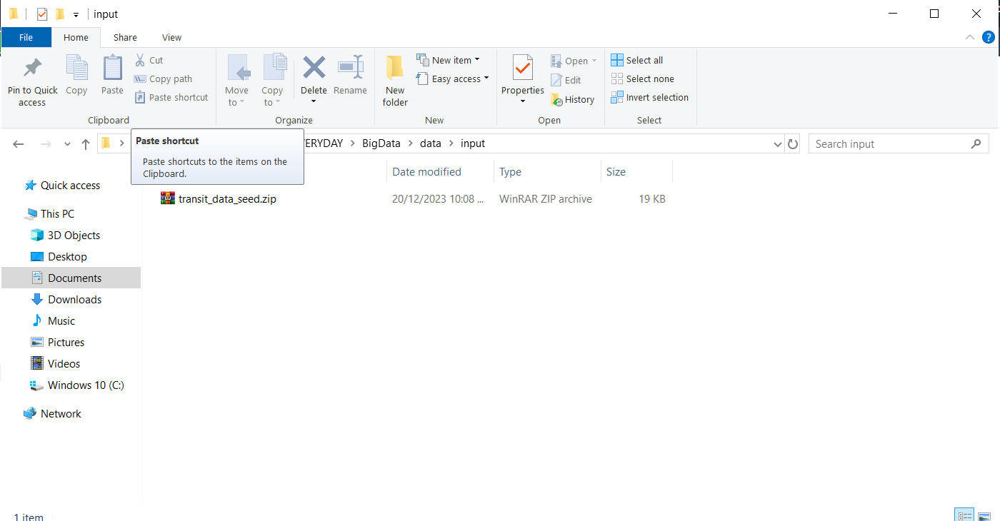
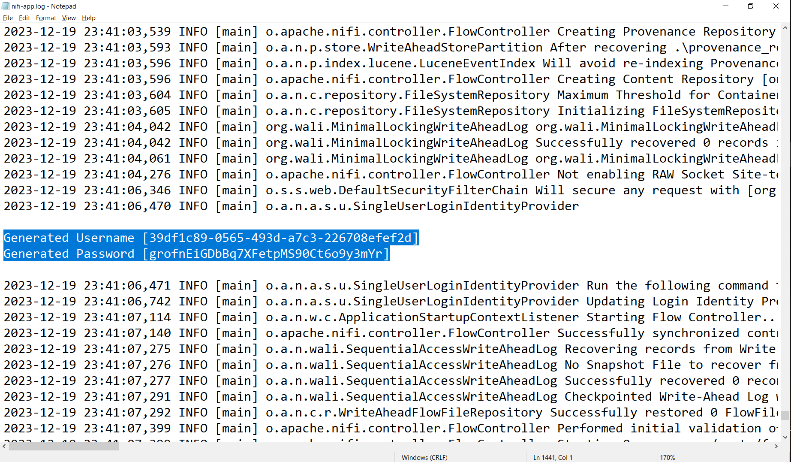

# Analyze Transit Patterns with Apache NiFi

## Abstract

I did this project following the instructions of: https://github.com/xvanausloos/hdp_data_tutorials/blob/master/tutorials/hdf/analyze-transit-patterns-with-apache-nifi/tutorial-0.md

For the purposes of this project, assume that a city planning board is evaluating the need for a new highway.  This decision is dependent on current traffic patterns, particularly as other roadwork initiatives are under way. Integrating live data poses a problem because traffic analysis has traditionally been done using historical, aggregated traffic counts.  To improve traffic analysis, the city planner wants to leverage real-time data to get a deeper understanding of traffic patterns.  NiFi was selected for this real-time data integration.

## Data

* https://github.com/xvanausloos/hdp_data_tutorials/blob/master/tutorials/hdf/analyze-transit-patterns-with-apache-nifi/assets/transit_data_seed.zip

  

## Goals and Objectives

The learning objectives of this project are to:

- Understand Apache NiFi fundamentals
- Introduce NiFi’s HTML user interface
- Introduce NiFi processor configuration, relationships, data provenance, and documentation
- Create dataflows
- Incorporate APIs into a NiFi dataflow
- Learn about NiFi templates
- Create Process Groups

## Installing Apache NiFi in a Windows Machine

* https://www.youtube.com/watch?v=ydhcxBNJ6Fs&list=PL55symSEWBbMBSnNW_Aboh2TpYkNIFMgb&index=6
This link will show you how to install Apache NiFi in Window. Notice that, If you have downloaded the latest NiFi version 1.14.0+ then NiFi won't be accessible using http://localhost:8080/nifi

To access NiFi in this case, you have to use the HTTPS URL: https://127.0.0.1:8443/nifi

This will also prompt you to enter the Username and Password. You can get the Username and Password from the nifi-app.log file inside the /logs folder. 

Kindly search for "Generated Username" & "Generated Password" to find the Username and Password for your NiFi instance.

  

